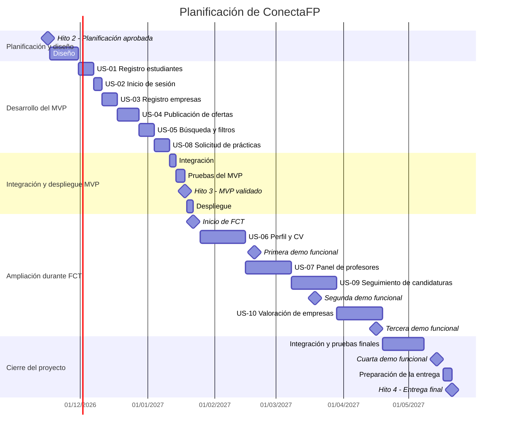

```mermaid
gantt
    title Planificación de ConectaFP
    dateFormat YYYY-MM-DD
    axisFormat %d/%m/%Y

    section Planificación y diseño
    Hito 2 - Planificación aprobada :milestone, h2, 2026-11-16, 0d
    Diseño :design, 2026-11-17, 13d

    section Desarrollo del MVP
    US-01 Registro estudiantes :us01, 2026-11-30, 7d
    US-02 Inicio de sesión :us02, after us01, 4d
    US-03 Registro empresas :us03, after us02, 7d
    US-04 Publicación de ofertas :us04, after us03, 10d
    US-05 Búsqueda y filtros :us05, after us04, 7d
    US-08 Solicitud de prácticas :us08, after us05, 7d

    section Integración y despliegue MVP
    Integración :integration1, after us08, 3d
    Pruebas del MVP :testing1, after integration1, 4d
    Hito 3 - MVP validado :milestone, h3, 2027-01-18, 0d
    Despliegue :deployment, 2027-01-19, 3d

    section Ampliación durante FCT
    Inicio de FCT :milestone, fct, 2027-01-22, 0d
    US-06 Perfil y CV :us06, 2027-01-25, 21d
    Primera demo funcional :milestone, demo1, 2027-02-19, 0d
    US-07 Panel de profesores :us07, 2027-02-15, 21d
    US-09 Seguimiento de candidaturas :us09, 2027-03-08, 21d
    Segunda demo funcional :milestone, demo2, 2027-03-19, 0d
    US-10 Valoración de empresas :us10, 2027-03-29, 21d
    Tercera demo funcional :milestone, demo3, 2027-04-16, 0d

    section Cierre del proyecto
    Integración y pruebas finales :finaltests, 2027-04-19, 19d
    Cuarta demo funcional :milestone, demo4, 2027-05-14, 0d
    Preparación de la entrega :delivery, 2027-05-17, 4d
    Hito 4 - Entrega final :milestone, h4, 2027-05-21, 0d
```
